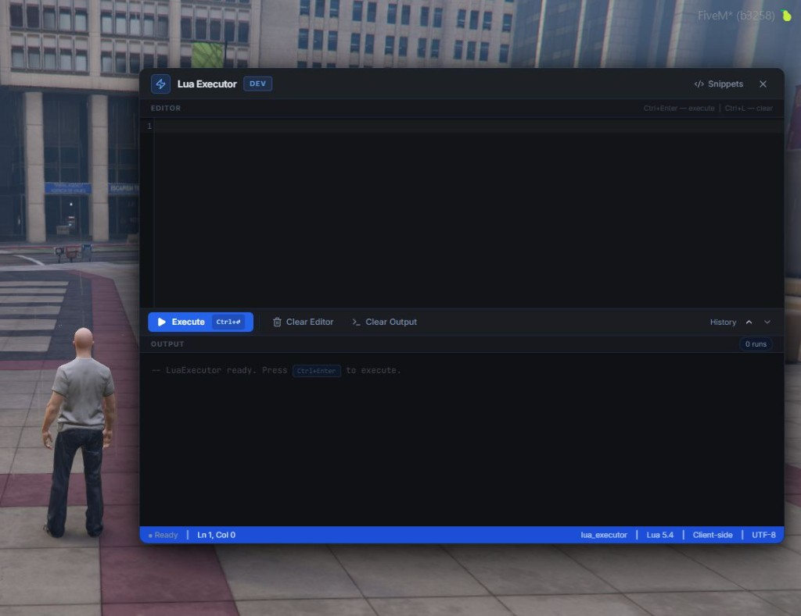

# fivem-lua-executor

A professional in-game Lua executor for FiveM development and testing. Built with Vite, React and Shadcn UI.



---

## Features

- Client-side Lua execution with full access to FiveM natives
- CodeMirror editor with Lua syntax highlighting, line numbers and bracket matching
- Execution history (Alt+Up / Alt+Down)
- Built-in code snippets (coords, vehicle info, nearby players and more)
- Draggable panel — position it anywhere on screen
- Whitelist or ACE permission system, configurable in `config.lua`
- Heartbeat watchdog — automatically releases game controls if the panel is force-closed
- Status bar showing cursor position, resource name and execution mode

---

## Requirements

- [ox_lib](https://github.com/overextended/ox_lib)

---

## Installation

1. Download or clone the repository into your `resources/` folder and rename it to `lua_executor`
2. Add to `server.cfg`:

```cfg
ensure lua_executor
```

3. Open `config.lua` and add your license identifier to the whitelist:

```lua
Config.Whitelist = {
    'license:YOUR_LICENSE_HERE',
    'license2:YOUR_LICENSE2_HERE',
}
```

4. Restart the resource or the server.

---

## Usage

| Action | Key |
|---|---|
| Open / close | `F7` (rebindable in GTA V settings) |
| Execute code | `Ctrl+Enter` |
| Clear editor | `Ctrl+L` |
| Previous snippet | `Alt+Up` |
| Next snippet | `Alt+Down` |
| Close panel | `Esc` |
| Force-release controls | `/execreset` |

---

## Configuration

All settings are in `config.lua`.

```lua
Config.Key      = 'F7'          -- toggle key
Config.PermMode = 'whitelist'   -- 'ace' | 'whitelist' | 'open'
Config.Whitelist = {
    'license:...',
    'license2:...',
}
```

### Permission modes

| Mode | Description |
|---|---|
| `whitelist` | Allow specific identifiers listed in `config.lua` |
| `ace` | Use `add_ace group.admin luaexecutor.allow allow` in `server.cfg` |
| `open` | No restriction — local testing only |

---

## Development

The UI is built with Vite + React. To rebuild after changes:

```bash
cd ui
npm install
npm run build
```

The output goes to `html/` automatically.

---

## License

MIT
